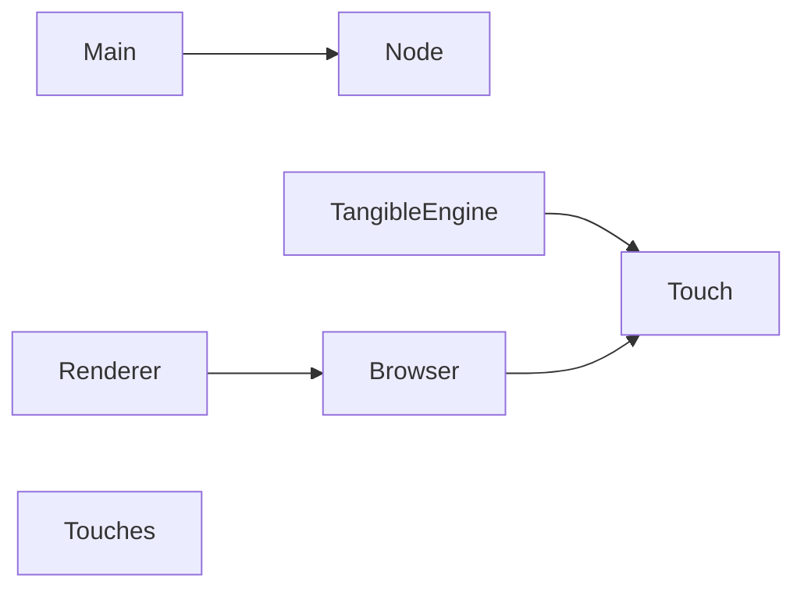

# Pattern Matcher

Using basic geometry to match patterns based on distances between points.

- Recognize patterns based on points and their distances, irrespective of their orientation or rotation
- Pattern recognition
- Geometric transformations
- Machine learning, depending on the exact requirements

The module will receive three points, each representing a vertex of a pattern. Each pattern has a unique identifier (ID) based on the relative distances between the points. The goal is to calculate these distances, compare them to a predefined set of patterns, and identify the pattern irrespective of its rotation or orientation on the screen.

```javascript
const patternRecognition = require('./patternRecognition');

const point1 = { x: 0, y: 0 };
const point2 = { x: 1, y: 1 };
const point3 = { x: 1, y: 0 };

const patternId = patternRecognition.identifyPattern(point1, point2, point3);

console.log('Identified Pattern:', patternId);
```


