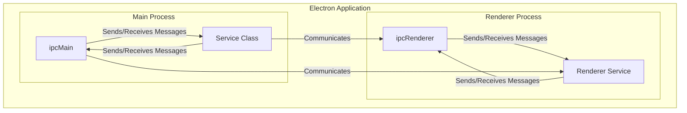

# Tangible Engine

## Main Process

```javascript
// main.js
//...
const net = require('net');
const TangibleEngineNode = require('./TangibleEngineNode.js');
//...
function createWindow() {
  //...
  const socket = net.connect({ host: '127.0.0.1', port: 4949 });
  const teNode = new TangibleEngineNode(socket);

  teNode.on('patterns', (response) => {
    mainWindow.webContents.send('tangible-engine-patterns', response);
  });

  teNode.on('connect', () => {
    mainWindow.webContents.send('tangible-engine-update', 'Connected to service');
  });

  teNode.on('disconnect', () => console.log('Disconnected from service'));

  teNode.on('update', (response) => {
    // Todo: !Important. The teNode instance needs to be destroyed when the browser is closed.
    mainWindow.webContents.send('tangible-engine-update', response);
  });

  ipcMain.on('start-tangible-engine', (event, msg) => {
    console.log('ipcMain start-tangible-engine : ', msg);
    try {
      teNode.init();
    } catch (e) {
      console.log('Error starting TE : ', e);
    }
  });

  ipcMain.handle('update-tangible-engine', async (event, payload) => {
    function doSomeWork(arg) {
      return arg;
    }
    const result = await doSomeWork('done');
    teNode.write(payload);
    return result;
  });

  mainWindow.on('closed', function () {
    // Dereference the window object, usually you would store windows
    // in an array if your app supports multi windows, this is the time
    // when you should delete the corresponding element.
    teNode.deInit();
    teNode = null;
    mainWindow = null;
  });
  //...
}
//...
```

# Preload

```javascript
  contextBridge.exposeInMainWorld('electronAPI', {
    startTangibleEngine: (msg) => ipcRenderer.send('start-tangible-engine', msg),
    onTangibleEngineUpdate: (callback) => ipcRenderer.on('tangible-engine-update', (_event, value) => callback(value)),
    onTangibleEnginePatterns: (callback) => ipcRenderer.on('tangible-engine-patterns', (_event, value) => callback(value)),
    updateTangibleEngine: (payload) => ipcRenderer.invoke('update-tangible-engine', payload),
    onReply: () => ipcRenderer.on('update-tangible-engine-reply', (_event, arg) => {
      console.log('REPLY!!', arg)
    })
  });`
```

# HTML

```html
<script type="module" src="./renderer.js"></script>
```

# Renderer

```
Writing to client

++++ Writing to client ++++ {
  POINTERS: [
    { Id: 0, X: 666, Y: 424 },
    { Id: 1, X: 520, Y: 198 },
    { Id: 2, X: 367, Y: 464 }
  ],
  Type: 'Update'
}

```


